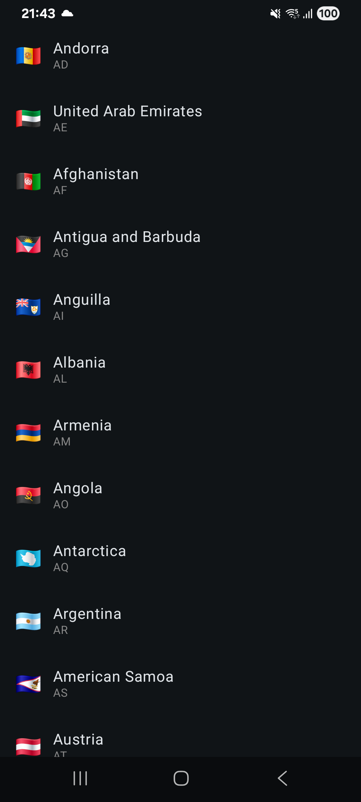
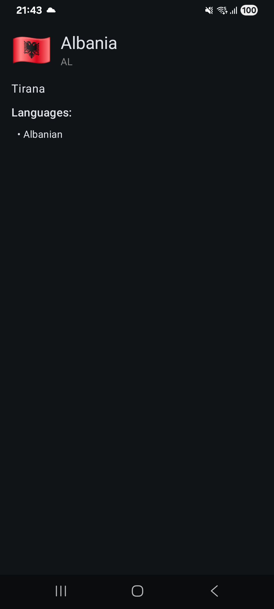

# 🌍 Countries Explorer

An Android application built with Kotlin and Jetpack Compose.  
It fetches a list of countries from a GraphQL API and allows navigation to a country details screen with additional information.

---

## ✨ Features
- Display a list of countries
- Navigate to a detailed country screen
- Integration with **GraphQL**
- Modern UI using **Jetpack Compose**
- Dependency injection with **Hilt**
- Asynchronous data handling with **Kotlin Coroutines**

---

## 🛠️ Tech Stack & Libraries
This project leverages modern Android libraries and tools:

- **[Jetpack Compose](https://developer.android.com/jetpack/compose)** – Declarative UI
- **[Navigation3](https://developer.android.com/jetpack/compose/navigation)** – Navigation between screens
- **[Apollo GraphQL](https://www.apollographql.com/)** – GraphQL integration
- **[Hilt](https://dagger.dev/hilt/)** – Dependency Injection
- **Kotlin Coroutines** – Asynchronous programming
- **Lifecycle & ViewModel** – State management

---

## 📷 Screenshots
| Country List                      | Country Details                        |
|-----------------------------------|----------------------------------------|
|  |  |

---

## 🎥 Demo

